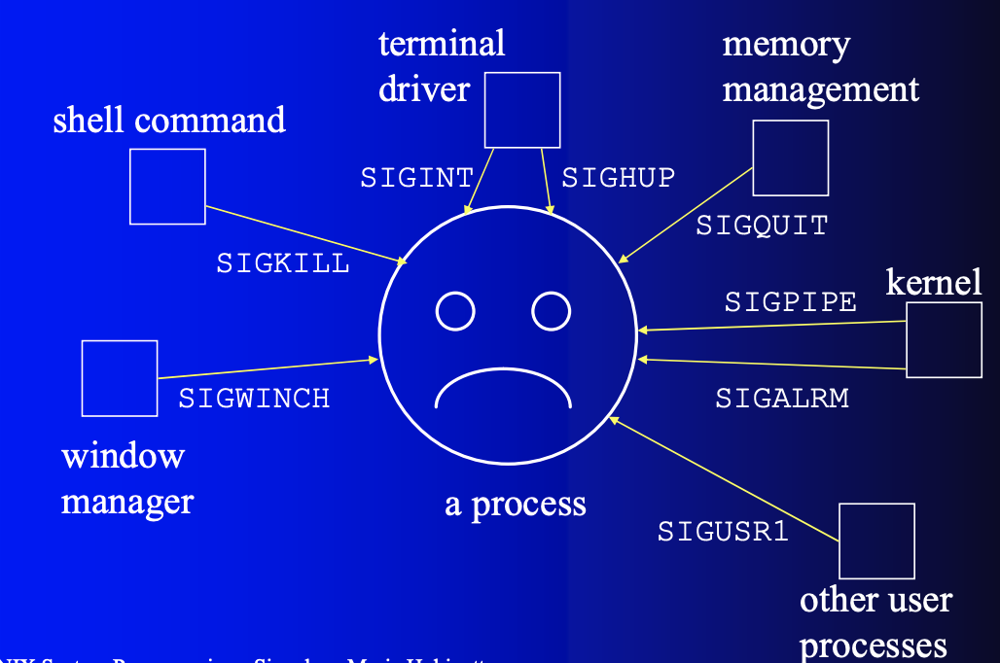

# Minitalk

The purpose of this project is to code a small data exchange program
using UNIX signals.

## Mandatory Part:

- create a communication program in the form of a client and a server.

- The server must be started first

- The client takes two parameters (The server PID & The string to send).

- The server has to display the string pretty quickly.

- The server should be able to receive strings from several clients in a row without needing to restart.

- The communication between client and
server has to be done only using
UNIX signals(SIGUSR1 and SIGUSR2).

## Bonus part:

- The server acknowledges every message received by sending back a signal to the
client.

- Support Unicode characters.

## Allowed Functions:

- write( ), ft_printf( ), signal( ), sigemptyset( ), sigaddset( ), sigaction( ), kill( ), getpid( ), malloc( ), free( ), pause( ),  sleep( ), usleep( ), exit( ).

## Acknowledgements:

## UNIX PROCESSES

The UNIX system is a multitasking system (a system capable of executing several tasks at the same time) and traditionally we call a process the instance of a program that is currently running. Each UNIX process has its own resources (memory space, table of open files...). We can see that any activity in the UNIX system is a process; if it is a process related to the system (swapper, crons...) we speak of a system process and if it is a user application i.e. the execution of a command or an application we speak of a user process.

- fork():

All processes, except the process with identification 0, are created by a call to fork().The process that calls fork() is called the parent process. The new process is called child process. Any process has only one parent process. Any process can have zero or more child processes. Each process is identified by a unique number, its PID. The process of PID=0 (swapper or sched)is created at the start of the machine,The zero process creates, thanks to a fork call, the init process of PID=1.The process of PID=1 of name init is the ancestor of all the other processes (the process 0 not realizing any more fork()), it is him who welcomes all the orphaned processes of father.

- State of a process:

  - Running: either having the processor or waiting for the processor.
  - Sleeping: waiting for a resource.
  - Stopped: usually stopped by CTRL-S, for example, or by a debugger.
  - Zombie: the process is finished but the kernel still keeps information about it that can be consulted by another process before final removal.

- init process / daemon processes:

The init process always has the process ID 1 and runs with superuser privileges. The init process can't be killed, and it terminates only when the system is shut down. The main task of init is to create and monitor a range of processes required by a running system.

A daemon (syslogd, httpd, etc.) is a special-purpose process that is created and handled by the system in the same way as other processes. However, it differs from other processes:
<ol>
  <li>It is long-lived. A daemon process is often started at system boot and remains in existence until the system is shut down.</li>
  <li>It runs in the background, and has no controlling terminal from which it can read input or to which it can write output.</li>
</ol>

- zone u and process table:

All processes are associated with an entry in the process table that is internal to the kernel. In addition, the kernel allocates for each process a structure called zone u , which contains private data of the process, only manipulable by the kernel. The process table allows us to access the region table by process which allows access to the region table. This double level of indirection allows to share regions. In the organization with a virtual memory, the table of regions is logically materialized in the page table. The region structures in the region table contain information about the type, access rights and location (memory addresses or disk addresses) of the region. Only the region u of the current process can be manipulated by the kernel, the others are inaccessible. The address of the zone u is placed in the status word of the process.


- PID:

Processes are identified by a unique number assigned by the kernel:(Process ID). System calls that concern processes use the pid number to designate the process that is being called. A process can get its pid by the getpid() system call.

- PPID:

PID of the father of the process. By default, all processes have a parent. There are only 2 exceptions:the init process which is the first one launched,orphans processes whose father has died. They are most often recovered by init.
- UID:

(User IDentifier)this is the identity of the user who invoked the process.There are three user IDs per process: the real UID, the effective UID, and the saved UID.The real UID is the one of the user who launched the program. The effective UID is the one corresponding to the privileges granted to the process. The saved UID is a copy of the old effective UID when it is modified by the process.

- GID:

Each user on the system belongs to one or more groups. These are defined in the /etc/groups file. A process is therefore also part of the groups of the user who started it. As we have seen with the UIDs, a process has several GIDs  real, effective, saved, as well as additional GIDs if the user who launched the process belongs to several groups.

## UNIX SIGNALS

Signals, are various notifications sent to a process in order to notify it of various "important" events. By their nature, they interrupt whatever the process is doing at this minute, and force it to handle them immediately. Each signal has an integer number that represents it (1, 2 and so on), as well as a symbolic name that is usually defined in the file /usr/include/signal.h or one of the files included by it directly or indirectly (HUP, INT and so on. Use the command 'kill -l' to see a list of signals supported by your system).Each signal may have a signal handler, which is a function that gets called when the process receives that signal.

- Sending Signals To Processes:

  - Using The Keyboard:

  There are certain key presses that are interpreted by the system as requests to send signals to the process with which we are interacting: Ctrl-C(SIGINT)By default, this signal causes the process to immediately terminate,Ctrl-Z(SIGTSTP)By default, this signal causes the process to suspend execution,Ctrl-\(SIGABRT)By default, this signal causes the process to immediately terminate(i.e. Ctrl-\ doing the same as Ctrl-C).
  - Using The Command Line:

  The kill command accepts two parameters: a signal name (or number), and a process ID. Usually the syntax for using it goes something like: kill - `<signal>` `<PID>`
  - Using The System Calls:

  This is the normal way of sending a signal from one process to another.

    #include <unistd.h>

    #include <sys/types.h>

    #include <signal.h>

    pid_t my_pid = getpid();

    kill(my_pid, SIGSTOP);

  - usleep():
  
  function suspends execution of the calling thread for (at least) usec microseconds(function returns 0 on success.  On error, -1).

  - Catchable And Non-Catchable Signals:

  Most signals may be caught by the process, but there are a few signals that the process cannot catch, and cause the process to terminate.For example, the KILL signal,STOP is also a signal that a process cannot catch.

- Signal Sources:



- pause():

Suspend the calling process until a signal is caught,return -1 in error case,pause() only returns after a signal handler has returned.

- the difference between sigaction and signal?:

  - The signal() function does not block other signals from arriving while the current handler is executing; sigaction() can block other signals until the current handler returns.
  - The signal() function (usually) resets the signal action back to SIG_DFL (default) for almost all signals. This means that the signal() handler must reinstall itself as its first action. It also opens up a window of vulnerability between the time when the signal is detected and the handler is reinstalled during which if a second instance of the signal arrives, the default behaviour (usually terminate, sometimes with prejudice - aka core dump) occurs.
  - The exact behaviour of signal() varies between systems — and the standards permit those variations.
  - The behavior of signal() varies across UNIX versions, and has also varied historically across different versions of Linux. Avoid its use: use sigaction(2) instead.

- sigaction():

The basic form of a sigaction call is: sigaction(signum, &action, &oldaction);
signum is the signal number you want to modify. Both action and oldaction are sigaction structs with action specifying the new setting and oldaction being used to save the existing action state. You can use NULL for either action or old action.

  - sigaction struct:

    struct  sigaction {

	  union __sigaction_u __sigaction_u;  /* signal handler */

	  sigset_t sa_mask;               /* signal mask to apply (additional signal to be blocked)*/

	  int     sa_flags;               /* modifies action of the signal */

    };
  
  The first field is a pointer to the signal handler function which accepts a single int which is set to the signal number. It can also be set to SIG_DFL to set the default action or SIG_IGN to ignore the signal.The sa_mask field is the bitwise OR of a set of constants which indicate which signals are to be blocked while the handler is running.The sa_flags field controls how the signal is processed.

  - SA_SIGINFO:

  SA_SIGINFO (since Linux 2.2) The signal handler takes three arguments, not one. In this case,sa_sigaction should be set instead of sa_handler.  This flag is meaningful only when establishing a signal handler.

  If SA_SIGINFO is specified in sa_flags, then sa_sigaction (instead of sa_handler) specifies the signal-handling function for signum. This function receives three arguments, as follows:
  
  void handler(int sig, siginfo_t *info, void *ucontext){...}

  These three arguments are as follows:

  sig:The number of the signal that caused invocation of the handler.

  info:A pointer to a siginfo_t, which is a structure containing further information about the signal

  The siginfo_t data type is a structure with the following fields:

  typedef struct __siginfo {

  ...

	pid_t   si_pid;                 /* sending process */

  ...

  } siginfo_t;

- signals and printf:

we shouldn't be using printf within a signal handler for the simple reason that the main program has been interrupted and it could be in the middle of a printf call, and in principle even this printf call could be interrupted and so on.

- Asynchronous nature of signals:

The asynchronous nature of signals means you have to protect against interruptions and restarts. In particular, make sure you block signals when in a signal handler.

## Difference between ASCII and Unicode:

## Usage:

- Clone repository

```bash
  git clone https://github.com/Boumlik-Brahim/Minitalk.git && cd Minitalk
```

- Compile mandatory server and client

```bash
  make
```

Compile bonus server and client

```bash
  make bonus
```

## License

[]()